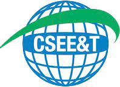

# EbL_Over_PbL: Empirical Analysis of Industry-Aligned Laboratory Models in Software Engineering Education

<p align="center">
  
</p>

<p align="center">
  <a href="#abstract">Abstract</a> •
  <a href="#repository-architecture">Architecture</a> •
  <a href="#scientific-findings">Scientific Findings</a> •
  <a href="#operational-requirements">Operational Requirements</a> •
  <a href="#research-scope">Research Scope</a> •
  <a href="#citation">Citation</a>
</p>

This research artefact operationalises the comparative analysis of Software Engineering pedagogical models, specifically contrasting **Experience-based Learning (EbL)** within a collaborative laboratory against traditional **Project-based Learning (PbL)**.

The repository provides a systematic pipeline for mining repository metadata to quantify the transition from *"academic coding"* to professional software engineering responsibility.

---

# Abstract

Traditional Software Engineering Education (SEE) tends to isolate students from professional realities, creating an *"academic island"* where evaluations reward final deliverables over the technical nuances and collaborative dynamics of real-world development.

Experiential learning offers a pedagogical bridge out of this isolation, shifting students from passive learners into active technical contributors who internalize professional rigor and long-term sustainability as core values.

This study evaluates a collaborative laboratory model designed as a strategic intermediary between academia and industry, examining how such environments facilitate the transition from conventional academic coding to roles defined by genuine professional responsibility.

Through repository mining, our empirical analysis compares key metrics, including Pull Request granularity and refactoring ratios, across:

- Project-oriented academic courses
- Open-source ecosystems (VSCode and React)
- An open-source platform developed within the laboratory

Our findings demonstrate that embedding experiential learning within an applied research laboratory enables students to engage in real-world projects that unite technical excellence with high-impact social technology.

---

# Repository Architecture

The repository is structured as a computational pipeline designed to transform raw repository events into publication-ready statistical visualisations.

```text
.
├── graph                   # Graph-based analysis and network visualisations
├── metrics
│   ├── data
│   │   ├── bronze          # Raw GraphQL extractions (GitHub/GitLab)
│   │   └── silver          # Curated and filtered datasets
│   ├── notebooks           # Analytical layer and figure generation
│   │   └── prs_viz_bp_paper.ipynb # Primary analysis notebook
│   └── scripts             # Operational extraction/filtering logic
│       ├── extract.py      # GraphQL API orchestration
│       └── filter.py       # Temporal and organisational curation logic
├── requirements.txt        # Dependency specification
└── README.md
```

---

# Operational Requirements

To replicate the analysis, ensure a **Python 3.8+** environment is available.

## Install Dependencies

```bash
pip install -r requirements.txt
```

## Extraction Pipeline

The extraction pipeline requires valid API credentials for:

- GitHub
- GitLab

Configure the credentials as environment variables before executing:

```bash
python metrics/scripts/extract.py
```

## Analysis Pipeline

Execute the primary notebook to reproduce the statistical figures and metric computations presented in the study:

```bash
jupyter notebook metrics/notebooks/prs_viz_bp_paper.ipynb
```

> **Note:**  
> Static PR datasets corresponding to the paper's analysis time frame are already included in the repository together with the analysis notebook, enabling partial reproducibility without new API extraction steps.

---

# Scientific Findings

The empirical analysis reveals several critical transitions in student engineering behaviour within the collaborative laboratory model.

## Adoption of Agile Micro-Behaviours

Reduced PR granularity indicates a shift toward:

- Small Releases
- Continuous Feedback cycles
- Incremental collaboration practices

This behaviour diverges significantly from large and monolithic academic submissions commonly observed in traditional SEE contexts.

## Technical Maturity

Refactoring density within the laboratory environment suggests an intermediate maturity level situated between:

- Traditional coursework repositories
- High-scale industrial OSS ecosystems

## Architectural Literacy

Continuous engagement with unfamiliar codebases promotes:

- Broader architectural understanding
- Governance awareness
- Professional maintenance practices
- Collaborative code ownership

## Sustainability

Structured workload distribution within the laboratory model appears to mitigate:

- Deadline-driven development spikes
- Last-minute integration behaviour
- Unsustainable delivery patterns
